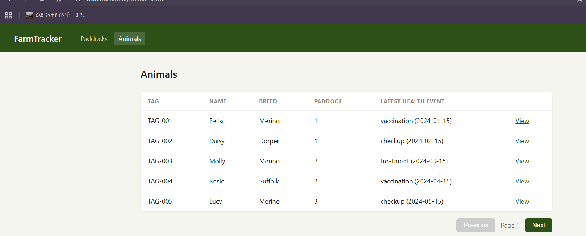
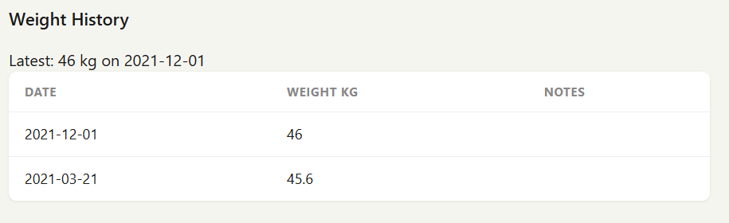
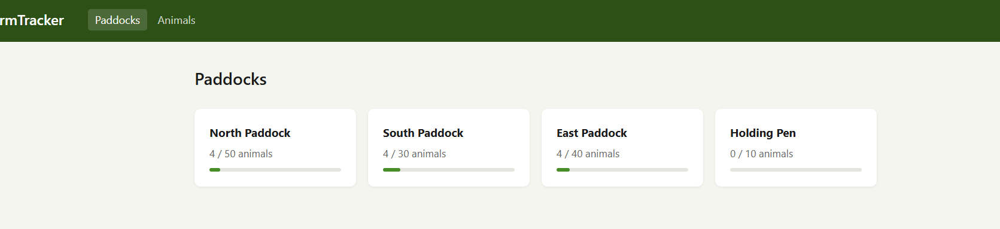

# Pull Request Description

## Candidate Details

Full name: Blen Abebe  
Email: blenkebede02@gmail.com  
Track: Fullstack

## Summary

This pull request completes the FarmTracker Fullstack assessment scope by:

- auditing the inherited application and documenting priorities in `AUDIT.md`
- fixing a paddock count consistency bug when animals move between paddocks
- implementing the full weight logging feature from `TODO.md` across the backend and frontend
- adding the frontend Weight History section to the animal detail page
- documenting the main architectural concern and a concrete next-step plan
- adding a short retrospective on trade-offs and follow-up work

## Screenshots

### Animal Detail Page Context



Animal detail page showing the existing health event workflow and the page context where weight tracking was added.

### Weight History With Recorded Measurement



Weight History after logging a measurement, showing the latest-weight summary, history table, and entry form.

### Optional: Weight History Empty State



Weight History empty state before any measurements are recorded.

## Audit Findings

The highest-priority issue was inconsistent paddock occupancy counts. The app manually updated `animal_count` in multiple places, but when an animal changed paddocks the old paddock was not decremented. That could make capacity information unreliable over time.

I also called out inconsistent validation and the growing concentration of business logic inside `app/backend/routes/animals.js`. The first issue was addressed directly in the weight tracking API by adding positive-weight validation and clear `404` / `422` handling. The architectural concern is captured in `ARCH_PROPOSAL.md`.

## What Changed

### Bug Fix

- Updated `PUT /api/animals/:id` so moving an animal between paddocks decrements the old paddock count and increments the new paddock count only when the paddock assignment actually changes.

### Weight Tracking API

- Added `animal_weights` table with a positive-weight database check.
- Added `POST /api/animals/:id/weights`.
- Added `GET /api/animals/:id/weights`.
- Added validation so `weight_kg` must be present, numeric, and positive, and `date` must be present.
- Returns `404` when the animal does not exist and `422` for invalid weight input.
- Added integration tests covering success, validation failures, missing animal handling, and descending date ordering.

### Frontend

- Added a Weight History section to `animal-detail.html`.
- Displays the latest recorded weight prominently.
- Lists all weight entries in a table.
- Adds a form to submit new weight records and reload the history after save.

## TODO Acceptance Criteria Coverage

- `POST /api/animals/:id/weights` creates a weight record and returns `201`.
- `POST /api/animals/:id/weights` returns `422` when `weight_kg` is missing or non-positive.
- `POST /api/animals/:id/weights` returns `404` when the animal does not exist.
- `GET /api/animals/:id/weights` returns all records ordered by date descending.
- The animal detail page displays weight history, highlights the latest recorded weight, and allows logging a new measurement.
- Backend tests cover the happy path and the required validation and error cases.

## Setup And Run

### Requirements

- Node.js 22.5+ (uses built-in `node:sqlite`)

### Install And Start

```bash
cd track2-fullstack/app/backend
npm install
node seed.js
npm start
```

Open:

- `http://localhost:3000`
- `http://localhost:3000/animal-detail.html?id=1`

## Testing

Run:

```bash
cd track2-fullstack/app/backend
npm test
```

Observed result:

- `11/11` tests passing with the backend integration suite

## Trade-Offs

- I kept the code changes tightly scoped instead of doing a larger backend refactor.
- I left the current stack in place because it is appropriate for the assessment and easy to review.
- I kept the frontend styling aligned with the existing page structure rather than introducing broader UI changes.

## What I'd Do Next

- Move animal business rules out of the route file and into a service layer.
- Wrap multi-step state changes such as paddock reassignment in explicit database transactions.
- Add lightweight frontend error feedback for failed weight submissions.
